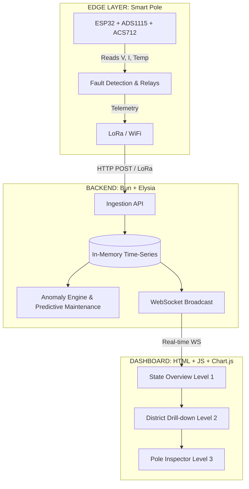

<div align="center">

# ⚡ TN-GridSense
### Distributed Smart Pole Telemetry & Predictive Fault Management System

[](https://bun.sh/)
[](https://www.espressif.com/)
[](https://elysiajs.com/)
[](https://developer.mozilla.org/en-US/docs/Web/JavaScript)
[](https://en.wikipedia.org/wiki/Internet_of_things)

*A state-scale platform for monitoring Tamil Nadu's electrical distribution grid at pole-level granularity.*  
**Each distribution pole becomes a real-time sensor, protection unit, and predictive maintenance data source.**

</div>

---

## 🏗️ Architecture



---

## 🚀 Quick Start

### Prerequisites
- [Bun](https://bun.sh/) v1.0+
- Modern web browser

### 1️⃣ Install Dependencies
```bash
cd backend
bun install
```

### 2️⃣ Start Backend
```bash
cd backend
bun run dev
```
> 🌐 *Server starts at `http://localhost:3000`*

### 3️⃣ Start Simulator (Demo Data)
*Open a second terminal:*
```bash
cd backend
bun run simulate
```
> 📊 *This generates telemetry for ~50 poles across 5 districts.*

### 4️⃣ View Dashboard
Open `http://localhost:3000` in your browser.

---

## 📁 Project Structure

<details>
<summary><b>firmware/ (ESP32 Arduino firmware)</b></summary>
<br>

- `pole_node/`
  - `config.h`: Pin assignments, thresholds, calibration
  - `pole_node.ino`: Main firmware (full sensor integration)
</details>

<details>
<summary><b>backend/ (Bun + Elysia Backend)</b></summary>
<br>

- `src/`
  - `index.ts`: Server entry (REST API + WebSocket)
  - `store.ts`: In-memory data store + aggregation
  - `analytics.ts`: Anomaly detection + predictive maintenance
  - `simulator.ts`: 50-pole data simulator
  - `types.ts`: TypeScript type definitions
</details>

<details>
<summary><b>dashboard/ (Web Dashboard - Static)</b></summary>
<br>

- `index.html`: Main HTML shell
- `css/`
  - `design-system.css`: Design tokens + components
  - `dashboard.css`: Page-specific styles
- `js/`
  - `app.js`: Main controller (routing, WebSocket)
  - `charts.js`: Chart.js wrapper
  - `state-view.js`: Level 1 — State overview
  - `district-view.js`: Level 2 — District drill-down
  - `pole-view.js`: Level 3 — Pole inspector
</details>

---

## 🔌 Hardware (Per Pole)

| Component | Purpose |
|-----------|---------|
| **ESP32 Dev Board** | Main controller |
| **ADS1115 16-bit ADC** | High-precision analog measurement |
| **AC Voltage Divider** | Mains voltage sensing (230V) |
| **ACS712 (30A)** | AC line current sensing |
| **INA219** | DC bus monitoring |
| **MAX6675 + K-type probe** | Transformer temperature |
| **LoRa SX1278 (433MHz)** | Long-range wireless |
| **OLED 0.96" I2C** | Local display |
| **5V Relay Module** | Fault protection |

---

## 📡 API Endpoints

| Method | Endpoint | Description |
|--------|----------|-------------|
| <kbd>POST</kbd> | `/api/telemetry` | Ingest telemetry packet |
| <kbd>GET</kbd> | `/api/stats` | System-wide statistics |
| <kbd>GET</kbd> | `/api/poles` | All poles list |
| <kbd>GET</kbd> | `/api/poles/:id` | Single pole + analytics |
| <kbd>GET</kbd> | `/api/districts` | All district summaries |
| <kbd>GET</kbd> | `/api/districts/:id` | Single district |
| <kbd>GET</kbd> | `/api/feeders` | All feeder summaries |
| <kbd>GET</kbd> | `/api/events` | Recent fault events |
| <kbd>GET</kbd> | `/api/analytics/maintenance` | Predictive maintenance |
| <kbd>GET</kbd> | `/api/analytics/atc-loss` | AT&C loss per feeder |
| <kbd>WS</kbd> | `/ws` | Real-time WebSocket updates |

---

<div align="center">
  <p>Licensed under <b>MIT</b></p>
</div>
