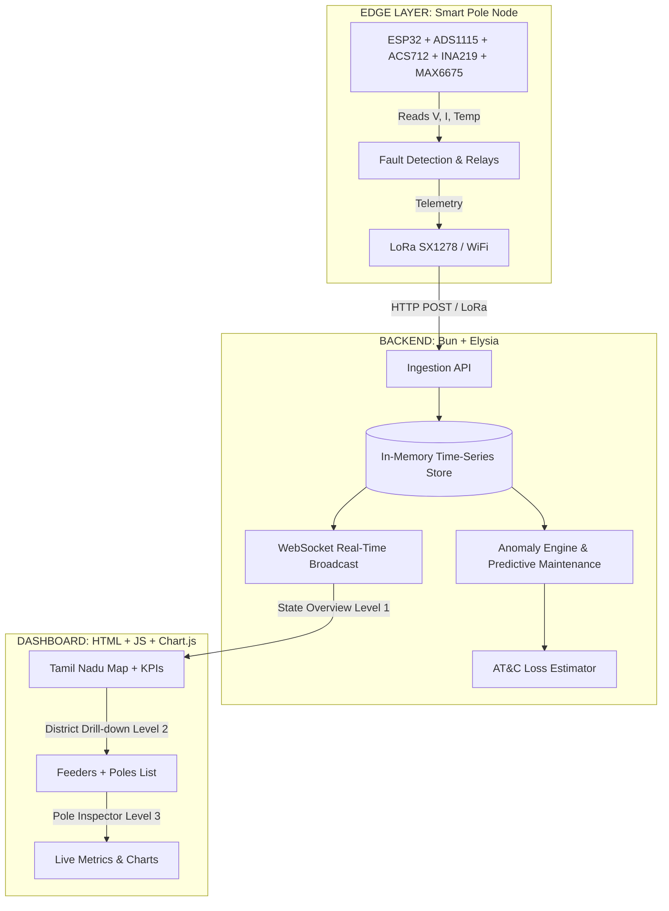

<div align="center">

# ⚡ TN-GridSense
### Distributed Smart Pole Telemetry & Predictive Fault Management System

[](https://bun.sh/)
[](https://www.espressif.com/)
[](https://elysiajs.com/)
[](https://developer.mozilla.org/en-US/docs/Web/JavaScript)
[](https://en.wikipedia.org/wiki/Internet_of_things)

*A state-scale platform for monitoring Tamil Nadu's electrical distribution grid at pole-level granularity.*  
**Each distribution pole becomes a real-time sensor, protection unit, and predictive maintenance data source.**

</div>

---

## ⚠️ The Core Problem

Tamil Nadu's distribution grid faces massive structural stress:
- **Evening Peak Deficit**: Up to 5,000 MW shortfall during 6–10 PM peak hours.
- **AT&C Losses**: Aggregate Technical & Commercial losses due to theft and inefficiency.
- **Delayed Maintenance**: Faults are detected *after* outages occur.
- **Renewable Variability**: Complex integration of solar and wind energy.

> **The Fundamental Gap:** The grid lacks **granular, real-time, pole-level visibility**. Utilities monitor at the feeder level and do not know micro-level stress conditions until a failure occurs. Failures are reactive. Losses are invisible until audited.

---

## 💡 The Vision

Deploy intelligent edge monitoring nodes on every distribution pole across Tamil Nadu. Instead of waiting for failures, the system detects and predicts them.

| Node Function | Capability |
|---------------|------------|
| **Real-time Sensor** | Voltage, current, temperature monitoring |
| **Protection Unit** | Automatic relay trip on fault (Over/Undervoltage, Overload) |
| **Telemetry Device** | Continuous 5-second interval data transmission |
| **Predictive AI** | Health scoring and transformer failure prediction |

---

## 🏗️ System Architecture



### 1. Edge Layer (Smart Pole)
Every 5 seconds, each pole transmits a secure, NTP-synced telemetry packet containing: `Voltage`, `Current`, `Temperature`, `Power`, `Health Score`, `Relay State`, `Status` (NORMAL / OVERVOLTAGE / OVERLOAD), and `Signal Strength`.

### 2. Communication Layer
- **Urban**: Direct WiFi / 4G connection from pole to cloud.
- **Rural**: LoRa (433 MHz) from pole to regional aggregators, then to cloud.

### 3. Backend Layer
Built on **Bun + Elysia** for extreme low-latency processing. Handles concurrent data ingestion, powers the anomaly and health-scoring engines, calculates AT&C loss deviations, and pushes real-time WebSocket updates.

### 4. Dashboard Layer
A 3-tier reactive UI providing a State Overview (Level 1), District Drill-down (Level 2), and individual Pole Inspector (Level 3).

---

## ⚡ 7 Key Functional Capabilities

1. **Real-Time Grid Visibility**: Pole-level voltage and current data across the state.
2. **Intelligent Fault Detection**: Auto-detects Overvoltage (>253V), Undervoltage (<207V), Overload (>25A), and Overheating (>80°C).
3. **Predictive Maintenance**: Computes a Transformer Health Score based on temperature trends and stability to predict days-to-failure.
4. **AT&C Loss Reduction**: Detects theft clusters by analyzing deviations between *Feeder Input Power* vs. *Sum of Pole-Level Loads*.
5. **Renewable Integration**: District-level load data enables pre-activation of backup generation before evening peaks.
6. **Maintenance Optimization**: Field staff get precise pole locations and fault types immediately, reducing downtime from hours to minutes.
7. **Data Integrity**: Edge-nodes support local buffering (100 packets) during outages and over-the-air (OTA) updates.

---

## 🚀 Quick Start

### Prerequisites
- [Bun](https://bun.sh/) v1.0+
- Modern web browser

### 1️⃣ Install Dependencies
```bash
cd backend
bun install
```

### 2️⃣ Start Backend
```bash
cd backend
bun run dev
```
> 🌐 *Server starts at `http://localhost:3000`*

### 3️⃣ Start Simulator (Demo Data)
*Open a second terminal:*
```bash
cd backend
bun run simulate
```
> 📊 *This generates simulated telemetry for ~50 poles across 5 Tamil Nadu districts.*

### 4️⃣ View Dashboard
Open `http://localhost:3000` in your browser.

---

## 📁 Project Structure

<details>
<summary><b>firmware/ (ESP32 Arduino firmware)</b></summary>
<br>

- `pole_node/`
  - `config.h`: Pin assignments, thresholds, calibration
  - `pole_node.ino`: Main firmware (full sensor integration)
</details>

<details>
<summary><b>backend/ (Bun + Elysia Backend)</b></summary>
<br>

- `src/`
  - `index.ts`: Server entry (REST API + WebSocket)
  - `store.ts`: In-memory data store + aggregation
  - `analytics.ts`: Anomaly detection + predictive maintenance
  - `simulator.ts`: 50-pole data simulator
  - `types.ts`: TypeScript type definitions
</details>

<details>
<summary><b>dashboard/ (Web Dashboard - Static)</b></summary>
<br>

- `index.html`: Main HTML shell
- `css/`
  - `design-system.css`: Design tokens + components
  - `dashboard.css`: Page-specific styles
- `js/`
  - `app.js`: Main controller (routing, WebSocket)
  - `charts.js`: Chart.js wrapper
  - `state-view.js`: Level 1 — State overview
  - `district-view.js`: Level 2 — District drill-down
  - `pole-view.js`: Level 3 — Pole inspector
</details>

<details>
<summary><b>docs/ (Project Documentation)</b></summary>
<br>

- `ARCHITECTURE.md`: Deep technical diagrams
- `PROPOSAL.md`: Business and technical proposal
- `WEB_SERIAL_PROTOTYPE.md`: Edge-to-dashboard hardware test guide
</details>

---

## 🔌 Hardware Bill of Materials (Per Pole)

| Component | Purpose |
|-----------|---------|
| **ESP32 Dev Board** | Main microcontroller |
| **ADS1115 16-bit ADC** | High-precision analog measurement |
| **AC Voltage Divider** | Mains voltage sensing (230V) |
| **ACS712 (30A)** | AC line current sensing |
| **INA219** | DC bus monitoring |
| **MAX6675 + K-type probe** | Transformer temperature monitoring |
| **LoRa SX1278 (433MHz)** | Long-range wireless communication |
| **OLED 0.96" I2C** | Local debugging display |
| **5V Relay Module** | Auto-trip fault protection |

---

## 📡 API Endpoints

| Method | Endpoint | Description |
|--------|----------|-------------|
| <kbd>POST</kbd> | `/api/telemetry` | Ingest edge-node telemetry packet |
| <kbd>GET</kbd> | `/api/stats` | System-wide aggregates & KPIs |
| <kbd>GET</kbd> | `/api/poles` | Get list of all poles |
| <kbd>GET</kbd> | `/api/poles/:id` | Get single pole live metrics + analytics |
| <kbd>GET</kbd> | `/api/districts` | All district health summaries |
| <kbd>GET</kbd> | `/api/feeders` | All feeder summaries |
| <kbd>GET</kbd> | `/api/events` | Recent anomaly & fault events |
| <kbd>GET</kbd> | `/api/analytics/maintenance` | Predictive maintenance queue |
| <kbd>GET</kbd> | `/api/analytics/atc-loss` | AT&C loss per feeder |
| <kbd>WS</kbd> | `/ws` | Real-time WebSocket multiplexing |

---

## 📈 Economic & State Impact

- **ROI**: Even a **1% reduction in AT&C losses** across Tamil Nadu saves **hundreds of crores annually**.
- **Asset Protection**: Drastically reduces transformer replacements (₹3–8 lakhs per unit) through predictive thermal management.
- **Future-Proofing**: Acts as the foundational data layer for smart city integration, demand response systems, and a state-level energy intelligence network.

<br>

<div align="center">
  <p>Licensed under <b>MIT</b></p>
</div>
